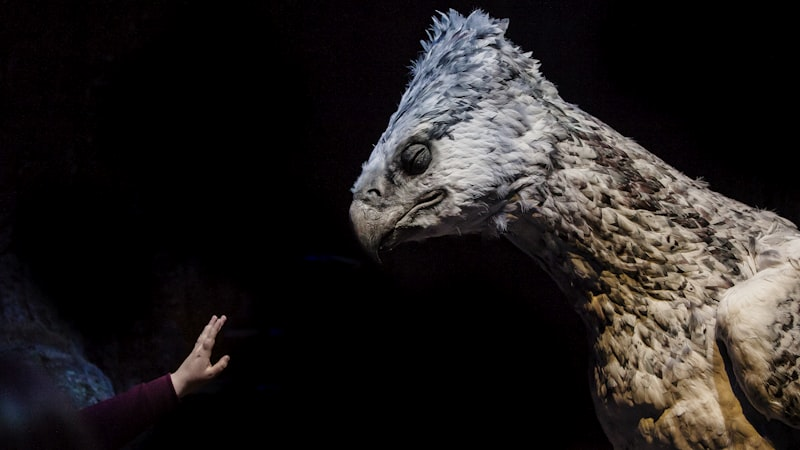
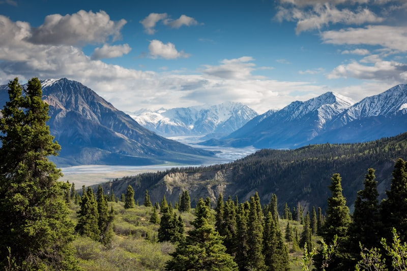
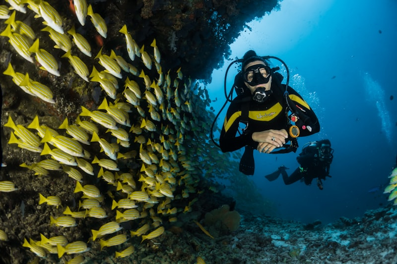
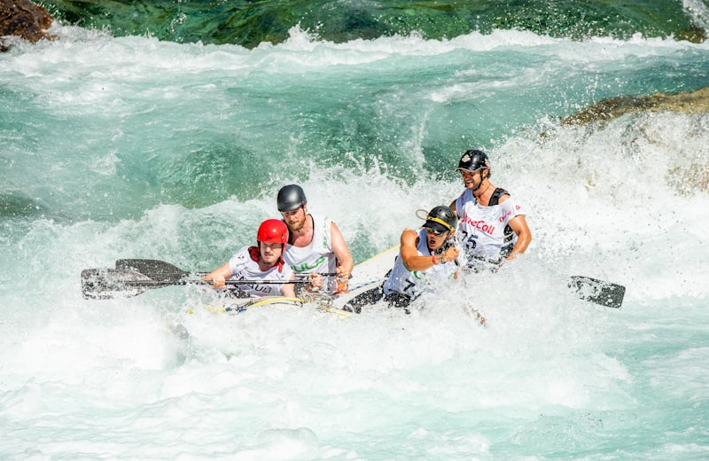
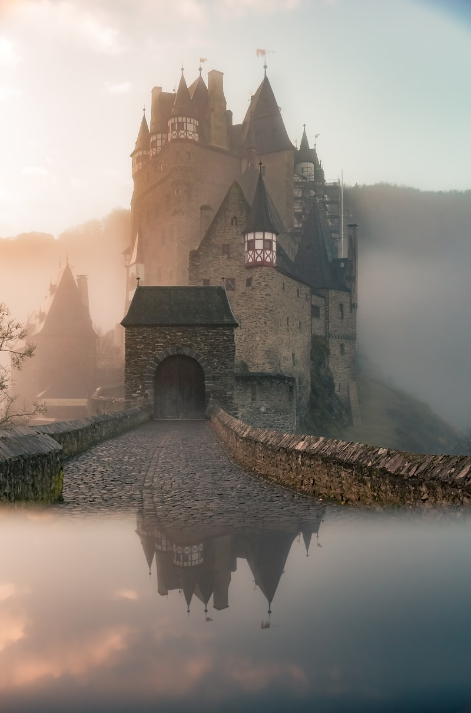

# 🔥 30 Before 30 — Harshit Edition

> **"Live with intention, conquer fear, build legacy, and cherish family."**

[](https://connectharshitjoshi.github.io/30-before-30/)
[](https://connectharshitjoshi.github.io/30-before-30/)
[](https://connectharshitjoshi.github.io/30-before-30/)

A master life blueprint and interactive roadmap tracking **30 landmark adventures, financial independence milestones, physical courage challenges, and tech achievements** to conquer before turning 30 on **28 January 2033** *(Date of Birth: 28 January 2003)*.

🔗 **Live Web App:** [https://connectharshitjoshi.github.io/30-before-30/](https://connectharshitjoshi.github.io/30-before-30/)

---

## 📸 High-Octane Adventure Gallery

| 🪂 Skydiving (13,000 ft) | 🏔️ Himalayan Snow Summit | 🤿 Open Ocean Scuba Diving |
| :---: | :---: | :---: |
|  |  |  |
| *Skydive Dubai / Interlaken* | *Kedarkantha & Hampta Pass* | *Havelock Reefs / Bali Shipwreck* |

| 🌊 Grade IV River Rafting | 🎈 Sunrise Hot-Air Ballooning | 🏍️ 1000+ km Overland Expedition |
| :---: | :---: | :---: |
|  |  |  |
| *Ganga Rapids & Zanskar Gorge* | *Bir Billing & Cappadocia* | *Leh Ladakh & Khardung La Pass* |

---

## 🗺️ Interactive Travel & Adventure Map

The application includes an **interactive geo-tagged map** built with **Leaflet.js** and dark-matter cartography:

- 📍 **54+ Geo-Tagged Destinations**: Pinning mountain summits, dropzones, coral reefs, wildlife reserves, extreme border posts, and cultural heritage cities across India and the globe.
- 🛣️ **6 Epic Overland Routes & Scenic Rails**:
  1. 🏍️ **The Legendary Himalayan Circuit**: *Delhi → Manali → Jispa → Sarchu → Leh → Khardung La (17,982 ft) → Pangong Tso* (~2,200 km)
  2. 🚗 **Coastal Highway 66 Odyssey**: *Mumbai → Goa → Gokarna → Udupi → Kochi* (~1,400 km)
  3. 🏜️ **Royal Rajasthan Desert Circuit**: *Delhi → Jaipur → Pushkar → Jodhpur → Jaisalmer → Longewala → Udaipur* (~1,800 km)
  4. 🚂 **UNESCO Kalka-Shimla Toy Train**: *Kalka → Barog (Tunnel 33) → Solan → Shimla* (102 Tunnels, 800+ Bridges)
  5. 🚂 **Konkan Railway Vistadome**: *Mumbai CST → Western Ghats Waterfalls → Madgaon Goa* (580 km)
  6. 🚂 **Pamban Sea Bridge Ocean Rail**: *Mandapam → Pamban Cantilever Bridge → Rameswaram*
- 🔄 **2-Way Real-Time Synchronization**: Ticking sub-tasks or marking goals complete turns the corresponding map pins into glowing emerald/gold achievement markers.
- ⚡ **Multi-View Modes**: Toggle between **30 Goals Roadmap**, **Adventure Map**, and **Split View**.

---

## 📋 The Complete 30-Goal Master Plan

### 💰 Pillar 1: Wealth, Business & Real-World Ventures

#### 01. Financial Growth & Security
Build an unshakable financial foundation with salary milestones, liquid emergency runway, and automated wealth compounding.
- [ ] ₹10+ LPA salary achieve karna
- [ ] Salary ko ₹15+ LPA tak le jaana (through tech upskilling / product roles)
- [ ] 6 months ka living expenses emergency fund banana (Liquid FD / High-yield savings)
- [ ] Regular investing system set karna (Monthly SIP in Index Funds + Multicap)
- [ ] Ek din ₹0-spend day challenge try karna (mindful spending reset)

#### 02. Digital Side Income & Product
Create independent income streams on the internet through digital products, micro-SaaS, or consulting.
- [ ] Ek sustainable side-income source establish karna
- [ ] Apna pehla product / micro-SaaS / digital asset launch karna
- [ ] First ₹10,000 online income earn karna
- [ ] Freelancing / consulting / digital product sales ko consistent banana

#### 03. Offline Real-World Venture ("My Own Thing")
Turn entrepreneurial vision into a physical, tangible business space that serves a real-world community.
- [ ] Ek physical offline venture plan karke kickstart karna
- [ ] Pick domain: Gym / Fitness Studio | Boutique Stay/Hostel | School/Academy | Cafe/Shop
- [ ] Business model & location finalize karna (e.g. Manali, Rishikesh, Goa, or Hometown)
- [ ] Grand opening / First 50 real offline customers serve karna

#### 04. Real-World Tech Product (100+ Active Users)
Engineer, ship, and scale a production-grade software application with validated customer feedback loops.
- [ ] Ek live tech project build karke launch karna
- [ ] Production deployment (Vercel / AWS / Railway)
- [ ] First 10 paying / active users onboard karna
- [ ] 100+ real users milestone cross karna with active feedback loop

---

### 🏔️ Pillar 2: High-Octane Adventure & Outdoors

#### 05. Himalayan & Mountain Adventure
Scale high-altitude Himalayan peaks, cross snow passes, and camp beneath starlit summit skies.
- [ ] 3+ day high-altitude trek (12,000+ ft) *(Kedarkantha, Har Ki Dun, Hampta Pass, Rupin Pass)*
- [ ] Glacier / snow summit reach karna
- [ ] Night trek / Waterfall trek *(Kalsubai night trek, Rajmachi, Dudhsagar falls)*
- [ ] High-altitude tent camping & summit sunrise

#### 06. Skydiving Freefall Experience
Leap out of an airplane at 13,000 feet and embrace pure terminal-velocity adrenaline.
- [ ] Tandem skydive from 10,000–13,000 ft *(Skydive Dubai Palm, Narnaul, Mysore, Pattaya, Interlaken)*
- [ ] Sunrise / sunset jump slot if available
- [ ] 4K video & photos preserve karna

#### 07. Bungee Jumping Face-Off
Stand at the edge of a high platform over a gorge and take the ultimate leap of faith.
- [ ] Rishikesh 83m jump complete karna *(Jumpin Heights over Hyul river or highest certified jump)*
- [ ] Overcome hesitation before stepping onto the plank

#### 08. White-Water Rafting Expedition
Navigate Grade III and IV wild river rapids, cliff jumps, and roaring water torrents.
- [ ] 16km–26km continuous rafting route *(Rapids: The Wall, Roller Coaster, Golf Course in Rishikesh)*
- [ ] Cliff jumping & body surfing in the river

#### 09. Scuba Diving & PADI Certification
Earn an internationally certified open-water diving license and explore deep coral marine ecosystems.
- [ ] PADI / SSI Open Water Diver certification complete karna *(Havelock Andaman, Netrani, Koh Tao, Bali)*
- [ ] Underwater marine life & sea turtles experience with video

#### 10. Aerial Adventures (Paragliding, Ballooning & Zipline)
Soar through thermal air currents, float in dawn hot-air balloons, and glide on mega ziplines.
- [ ] Bir Billing tandem flight (20-30 mins thermal soaring @ 8,000 ft)
- [ ] Hot-air balloon sunrise flight *(Pushkar / Jaipur / Cappadocia)*
- [ ] Multi-line mega zipline course *(Flying Fox Mehrangarh Fort / Shivpuri)*

#### 11. Learn Extreme Sports (Surf, Ski & Canyoneer)
Train technically under coaches to ride ocean waves, carve mountain snow, or scale granite boulders.
- [ ] Pick domain: Snowboarding/Skiing *(Gulmarg Apharwat 13,780 ft / Solang / Auli)*, Surfing *(Mulki Mantra Surf / Varkala)*, Canyoning *(Cherrapunji)*, or Bouldering *(Hampi)*
- [ ] Minimum 3-day dedicated coaching / workshop complete karna

#### 12. Wilderness, Safari & Marine Life
Immerse in deep jungle tiger tracks, Thar desert starry sand dunes, and open sea cetaceans.
- [ ] Tiger / Rhino spotting on an open gypsy safari *(Jim Corbett, Ranthambore, Kaziranga, Bandhavgarh)*
- [ ] Overnight tent camping in deep wilderness with bonfire *(Sam Sand Dunes Jaisalmer)*
- [ ] Dolphin / Whale encounter in the open sea *(Mirissa Sri Lanka / Palolem Goa)*

---

### 🌍 Pillar 3: Travel, Culture & Exploration

#### 13. Unknown City Solo Exploration
Drop into an unfamiliar city with zero fixed itinerary, navigate local transit, and discover authentic street culture.
- [ ] 3-4 days solo stay in an unfamiliar cultural destination *(Fort Kochi, Pondicherry, Varanasi, Shillong, Kyoto, Hoi An, Tbilisi)*
- [ ] Pure local street food + public transit exploration

#### 14. The 1000+ km Epic Road Trip
Embark on an epic multi-day driving / riding expedition across varied mountain, desert, or coastal terrains.
- [ ] 1000+ km multi-day driving / riding expedition complete karna *(Delhi → Leh Ladakh, Coastal Highway 66, or Rajasthan Desert Circuit)*
- [ ] Self-drive / bike trip with at least one completely unplanned detour

#### 15. International Travel (3 Countries)
Expand global horizons across 3 culturally diverse foreign countries with passport stamps and independent journeys.
- [ ] Country 1 (Adventure & Culture): Thailand / Vietnam
- [ ] Country 2 (Surf & Tropical): Sri Lanka / Bali (Indonesia)
- [ ] Country 3 (Futuristic / Alpine): UAE Dubai / Japan / Georgia
- [ ] At least one international solo / independent trip
- [ ] Local food & cross-cultural experiences

#### 16. The Great Indian Exploration (10 States)
Experience the sheer geographical and cultural diversity across North, South, East, and West India.
- [ ] North: Himachal Pradesh / Uttarakhand / Ladakh
- [ ] South: Kerala / Karnataka / Tamil Nadu
- [ ] West: Rajasthan / Goa / Maharashtra
- [ ] East & North-East: Meghalaya / Sikkim / West Bengal
- [ ] Ek safe/legal extreme border region visit karna *(Spiti Komic 15,027 ft, Turtuk LOC, Dhanushkodi, Longewala)*

#### 17. Iconic Scenic Train Journey
Travel on panoramic Vistadome tracks, UNESCO mountain toy trains, or oceanic sea-bridge railways.
- [ ] Vistadome Experience: Mumbai to Goa (waterfalls & Western Ghats tunnels)
- [ ] Mountain Heritage: Kalka to Shimla Toy Train (102 tunnels & pine forests)
- [ ] Sea Route: Chennai to Rameshwaram Express (Pamban sea-bridge crossing)

#### 18. The Ultimate Sunrise & Sunset Missions
Witness mother nature's most spectacular lighting events from high mountain ridges, ocean cliffs, and desert dunes.
- [ ] Mountain Dawn: Tiger Hill Darjeeling (Kanchenjunga glow) or Triund Top Dharamshala
- [ ] Beach Dusk: Radhanagar Beach Havelock or Sunset Point Kanyakumari
- [ ] Desert Dusk: Sam Sand Dunes Jaisalmer

#### 19. “Never Forget” Live Concert & Stadium Experience
Experience electrifying stadium vibes, front-row energy, and world-class live acoustics with thousands of fans.
- [ ] Electric crowd ke beech favorite artist live dekhna *(Sunburn Goa / Ziro Valley / Stadium Tours)*
- [ ] Front-row / stadium standing section energy soak karna

---

### 👨‍👩‍👦 Pillar 4: Family, Relationships & Gratitude

#### 20. Fully Sponsoring Parents' Dream Vacation
Treat Mummy-Papa to an all-expenses-paid luxury vacation funded 100% through your own earnings.
- [ ] Mummy-Papa ko apne 100% self-earned paison se luxurious holiday par le jaana *(Kashmir Dal Lake Houseboat / Munnar & Alleppey / Dubai / Char Dham)*
- [ ] Flights, premium hotel, food & cab self-sponsor karna
- [ ] Zero financial stress for them throughout the trip

#### 21. Meaningful Family Milestones & Surprises
Create emotional core memories for family with surprise landmark celebrations and milestone gifts.
- [ ] Unannounced anniversary / birthday milestone celebration host karna
- [ ] First major salary milestone se unhe aisi cheez gift karna jo woh khud kabhi nahi khareedte

#### 22. Closest Friends Crew Trip
Gather your closest inner-circle friends for an unforgettable 3+ day escape with zero distractions.
- [ ] Core school/college/work friends ke saath ek legendary vacation *(Goa private pool villa, Gokarna camp, Kasol / Tosh cabin)*
- [ ] All close friends together for 3+ uninterrupted days

#### 23. Giving Back & Empowering Someone
Create meaningful impact by uplifting someone's future through education, mentorship, or critical support.
- [ ] Kisi underprivileged student ki yearly education sponsor karna
- [ ] Kisi junior ko tech / career mein mentor karke first job dilwana
- [ ] Medical / emergency crisis mein anonymously kisi ki direct help karna

---

### 🧠 Pillar 5: Personal Growth, Habits & Mindset

#### 24. Conquer Your Deepest Fear
Step out of your comfort zone, embrace discomfort, and dismantle an intimidating personal boundary.
- [ ] Apne comfort zone ke bahar jaakar scary challenge attempt karna
- [ ] Public stage, solo international travel, extreme height, or confronting a long-delayed difficult goal

#### 25. Public Speaking to 100+ People
Command a stage, inspire a live crowd without relying on scripts, and establish presence.
- [ ] Stage par 100+ audience ke saamne without reading script impact create karna
- [ ] Deliver talk at tech meetup / college guest lecture / community summit *(GDG / PyCon / React meetup)*

#### 26. Master a New Creative Skill / Hobby (6+ Months)
Dedicate half a year to mastering a creative art purely for fulfillment and personal mastery.
- [ ] Pick discipline: Acoustic Guitar, Photography & Film Grading, Culinary cooking, Calisthenics, or Salsa/Dance
- [ ] 6 months structured practice & creating a tangible final piece

#### 27. The 30-Book Intellectual Library
Finish 30 seminal books that reshape your mental models on wealth, human philosophy, science, and leadership.
- [ ] 📘 **10 Business / Tech / Wealth**: *Psychology of Money, Zero to One, Rework, Atomic Habits, Almanack of Naval Ravikant*
- [ ] 📙 **10 Psychology / Philosophy**: *Meditations (Marcus Aurelius), Man's Search for Meaning, Sapiens, Courage to be Disliked*
- [ ] 📗 **10 Biographies / Science**: *Steve Jobs, Shoe Dog, Relativity, Breath*

---

### 💻 Pillar 6: Tech Creation & Crowning Glory

#### 28. Meaningful Open-Source Impact
Contribute to prominent global repositories, solve real bugs, ship features, and get merged into open ecosystems.
- [ ] Starred open-source repository mein meaningful PR merge karwana
- [ ] Documentation / Bugfix / Feature shipped in a popular framework or tool

#### 29. Build in Public & Authority Brand
Build a reputable developer brand, share high-value technical write-ups, and showcase signature projects.
- [ ] High-standard personal portfolio / tech blog publish karna
- [ ] Regular technical writeups / Twitter/LinkedIn builds
- [ ] One signature project complete with video walkthrough & documentation

#### 30. The Magnum Opus (One BIG Crowning Achievement)
Achieve the signature defining milestone of your 20s before your 30th birthday celebration.
- [ ] 30 se pehle ek aisi crowning achievement jo aaj impossible lagti ho *(Launching physical business, ₹30LPA+ / $50k+, 6,000m peak, peak physique)*
- [ ] 30th birthday (**28 Jan 2033**) par family & closest friends ke saath officially celebrate karna 🎂

---

## 🛠️ Tech Stack & Implementation Details

- **Frontend**: Vanilla HTML5, Modern Semantic Architecture
- **Design System**: Custom Cyber-Luxury & Glassmorphism Theme (CSS Custom Properties, Backdrop Filters, Radial Ambient Glow Orbs)
- **Interactive Map**: [Leaflet.js](https://leafletjs.com/) with CartoDB Dark Matter tiles & custom pulsing HTML/SVG markers
- **Data & State**: Zero backend required — State persisted in browser `localStorage`
- **Effects**: Real-time canvas particle confetti explosion engine, responsive layout, toast notifications

---

## 🚀 Running Locally

Clone the repository and open `index.html` in your browser:

```bash
# Clone the repository
git clone https://github.com/connectharshitjoshi/30-before-30.git

# Navigate to project folder
cd 30-before-30

# Open index.html directly or serve with VS Code Live Server / Python
python -m http.server 8080
```

Visit `http://localhost:8080` in your web browser.

---

<div align="center">
  <sub>🔥 <strong>30 Before 30 — Harshit Edition</strong> • Target Date: <strong>28 January 2033</strong></sub><br>
  <sub>Live Web App: <a href="https://connectharshitjoshi.github.io/30-before-30/">connectharshitjoshi.github.io/30-before-30</a></sub>
</div>
